# <h1>SEI-Project Three: Deverr</h1>
by [Alberto Cerrone](www.linkedin.com/in/alberto-cerrone), [Sandra Spighel](https://www.linkedin.com/in/sandraspighel/) & [Tim Frame](https://www.linkedin.com/in/tim-frame-187241100/) AKA SpicyKiwiPizza

👉 [<b>TRY ME</b>](#website link) 👈

<h2>Project Brief</h2>

This was the third project I completed in General Assembly's Immersive Software Engineering program. Project three was a group project. In project three we were tasked with building a full-stack MERN application over a 10 day time period.

<h2>Technologies used</h2>

### Languages 
* HTML
* CSS
* Javascript
### Frameworks & Libraries
* [React](https://reactjs.org/)
* [React-Router-Dom] (https://reactrouter.com/ )
* [React-Icons] (https://react-icons.github.io/react-icons/)
* [React-Slick] (https://react-slick.neostack.com/)
* [Styled-components] (https://styled-components.com)
* [Node](https://nodejs.org/en/)

### Dependencies & Components 
* [Axios](https://github.com/axios/axios)
* [Bcrypt] (https://pypi.org/project/bcrypt/) 
* [Cloudinary](https://cloudinary.com/documentation)
* [Express ](https://www.react.express/ )
* [Faker.js] (https://www.npmjs.com/package/faker ) 
* [JsonWebToken] (https://www.npmjs.com/package/jsonwebtoken )
* [Nodemon ](https://nodemon.io/ )
* [Mongoose ](https://mongoosejs.com/) 
* [Mongoose-unique-validator] (https://mongoosejs.com/docs/validation.html) 
* [MongoDB](https://www.mongodb.com/)
---
## Contributors
* Alberto Cerrone [📧](mailto:cerrone.alberto93@gmail.com)
* Sandra Spighel [📧](mailto:s.spighel@gmail.com)
* Tim Frame [📧](mailto:t.f.retouching@gmail.com)
---

<h2>The App: Deverr</h2>
<h3>App Overview</h3>

Deverr allows Developers to connect with companies or people advertsing jobs. On Deverr the people and companies advertsing jobs are referred to as Auctioners and the developers are referred to as Bidders.
Inspired by the Fiverr website, the platform is based on a Bidding system where Auctioneers post Jobs and interested Developers can 'bid' to win the contract.

---
<h2>How to use App</h2>

<ol>
<li>When a user first lands on the site they are taken to the home page. At this point that can choose from one of four options. If don't have an account they can click the register button to create an account. If they have an account they can click the login button. Alternatively they can click the jobs button and they taken to a page where they can view all jobs currently on the site. Lastly they can click the people button and will be taken to a page where they can see all the current users of the site.</li>

# 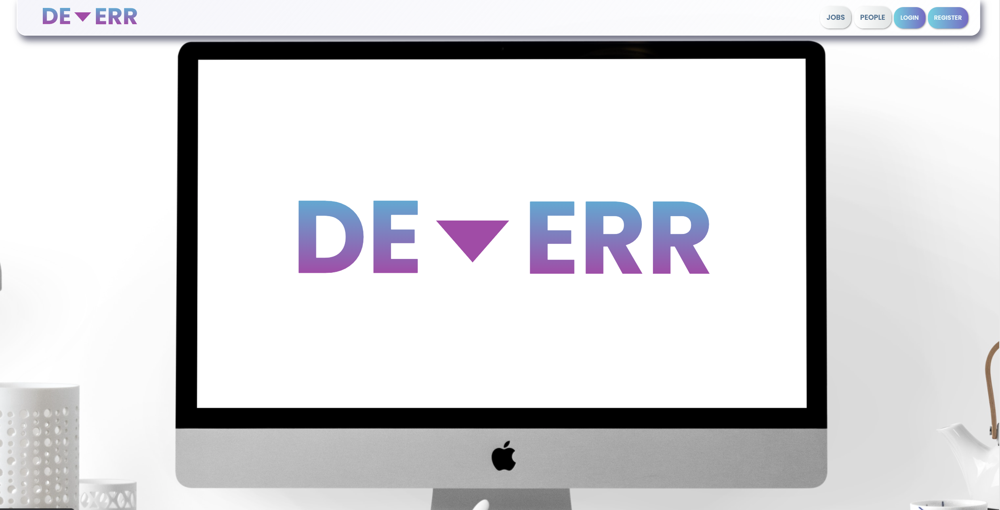  

<li>If a user has chosen to create an account they are taken to the register page. Firstly they need to select if they are a, ‘Bidder’ or an ‘Auctioneer. If a user chooses the ‘Bidder’, option they are required to provide name, email, password, password confirmation, bio, city, skills(can choose multiple), select there availability and choose a profile image. If a user chooses the ‘Auctioneer’ option they are required to provide a name, username, password, password confirmation, bio, city, confirm they are an auctioneer and a profile photo. If a user incorrectly fills in any form field and tries to submit the form they are will receive an error message underneath the form field that is incorrect.</li>

# 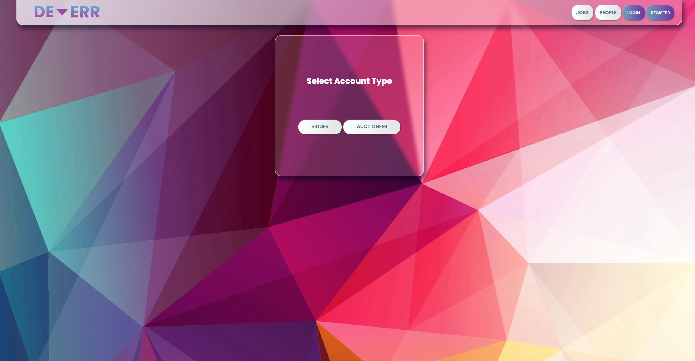  
# 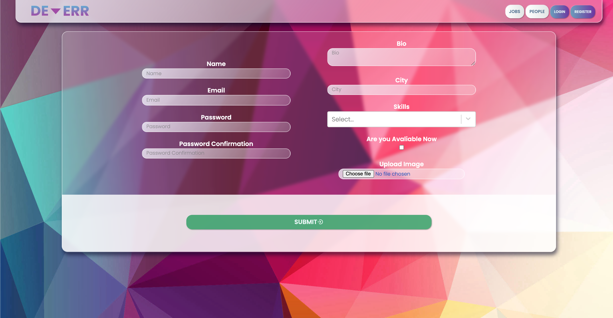  
# 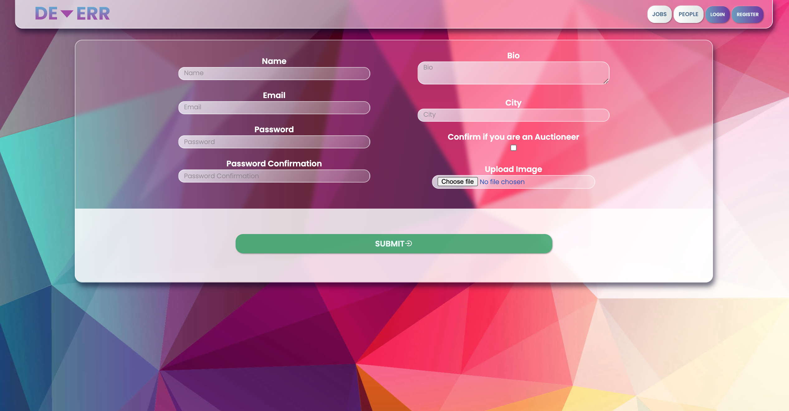  

<li>If the user registration is successful they are pushed onto the login page were the user needs to provide the email and password they provided during the registration process. If either field is incorrect on submission the user will receive an error message.</li>

#   

<li>Once logged in a user is taken to there profile page. On a users profile page they can see all the details they have provided during registration. A user also has the option to edit or delete their profile using the buttons at the bottom of the page. If a user is an auctioner they have an addtional button that gives them the option to create a new job.</li>

Bidder Profile:

# 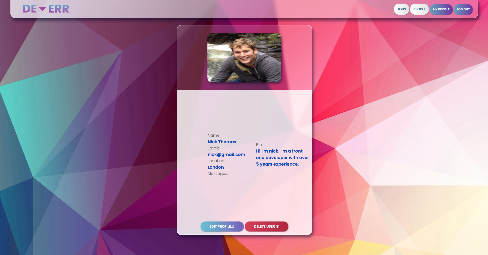 

Auctioneer Profile

# 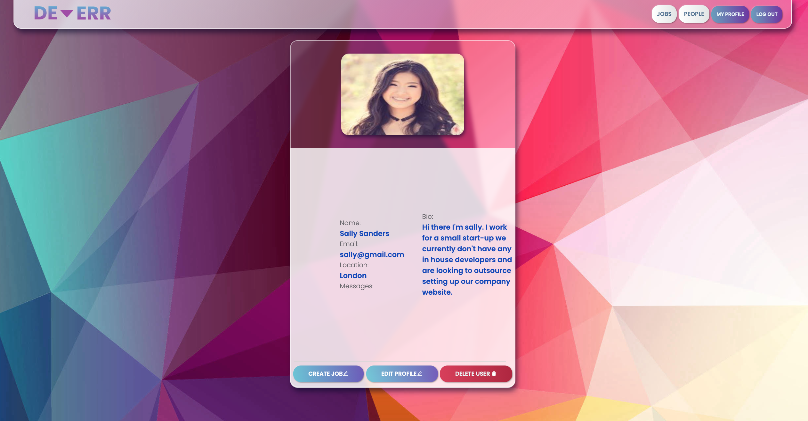 

<li>If an ‘Auctioneer’ chooses to create a job they are moved to the create new job page. Here the user needs to provide a job title, job description, job deadline, job category, the maximum fee payable for the job(bidders need to bid under this amount) and an image.</li>

# 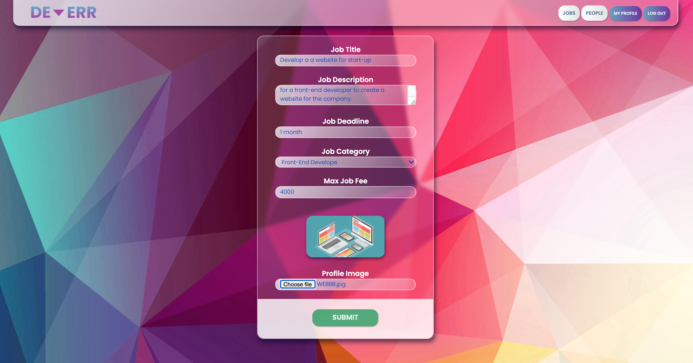 

<li>Once the job has been submitted the user is taken to the live view of the job. This is the view that all other users of the website will have if they clicked on a job thumbnail. Apart from the edit and delete button. This is only visible to the user who created the job.</li

# 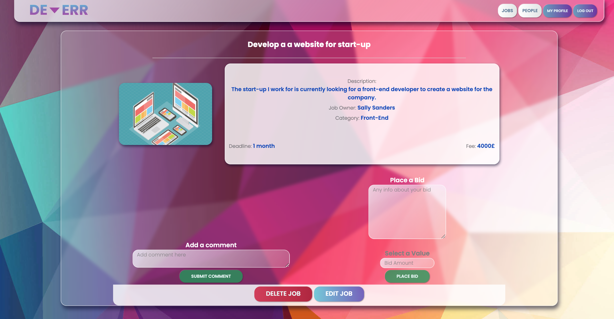 

<li>If a 'Bidder' clicks the jobs button located in the navigation bar they are taken to the jobs index. Here a bidder can view all jobs currently on the site or filter jobs by catergoty using the carousel at the top of the page.  <li>

# 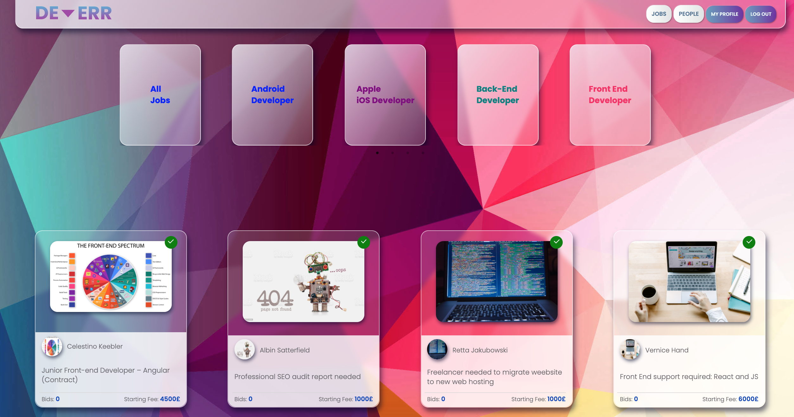 

<li>A ‘Bidder’ can click a job thumbnail and is taken to the live job view. Here a ‘Bidder’ can comment on a job and ask an ‘Auctioneer’ a question about a job by using the add comment form. The ‘Bidder can also place a bid on a job by using the 'Place Bid', field where the ‘Bidder’ needs to provide a short message and underneath that how much they would like to bid. Once a ‘Bidder’ has placed a bid they will get an alert to say their bid has been placed. The bid itself is only visible to the ‘Auctioneer’ who created the job.</li>

# 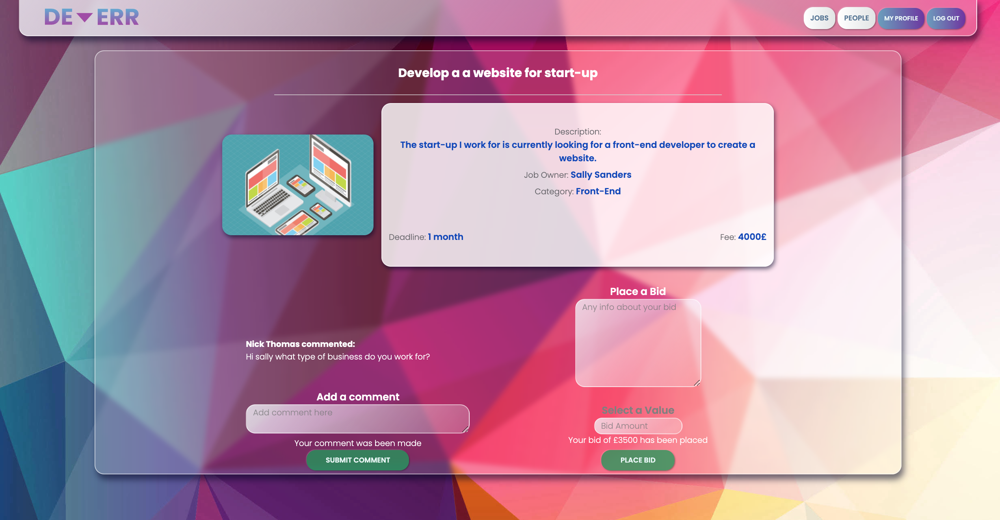 

<li>Once an ‘Auctioneer’ has received bids on a job they can select the winning bid by going to the live job view of the job they have posted. At the bottom of the job an ‘Auctioneer’ can see any bids they have received and needs to click the, ‘Accept This Bid’ button to choose the winning bid. Once the bid has been accepted, the ‘Accept This Bid’ button is removed from all remaining bids and a message is sent to the ‘Bidders’ profile with the winning bid.</li>

# 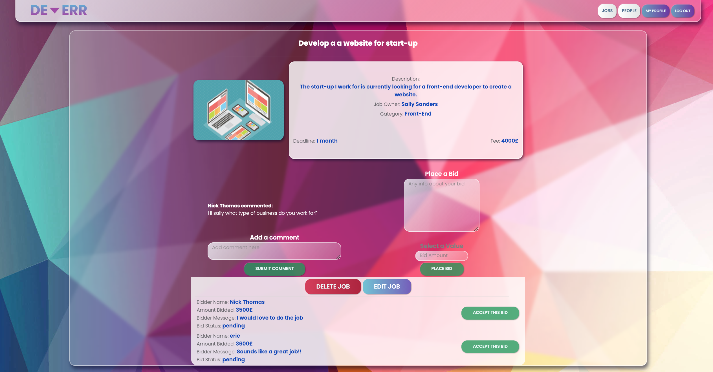 

<li>A ‘Bidder’ is then able to see the message when they log into their profile. From here the bidder can reply to the message and exchange details with the ‘Auctioneer’</li>

# 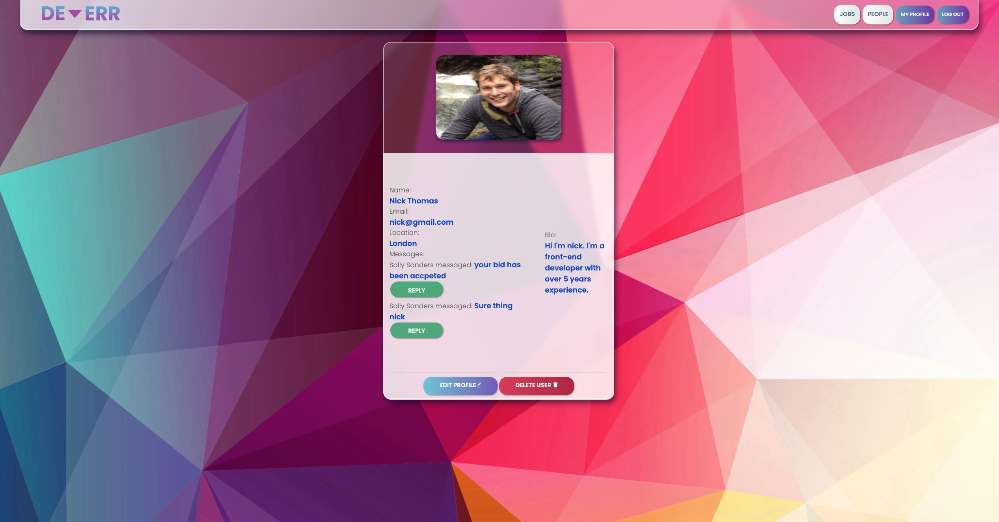 
</ol>

<h2>Creating The App</h2>

Once we had a clear idea for the project and how the app could potentially work we moved on to the planning phase. We began by creating wire frames to get a feel for the flow of the site and created a Trello board to track how we were building the site and who was responsible for what. It was at this point that each team member took ownership of an specfic area: Alberto was responsible for styling, I was responsible for the front-end and Sandra was responsible for the back-end.

# 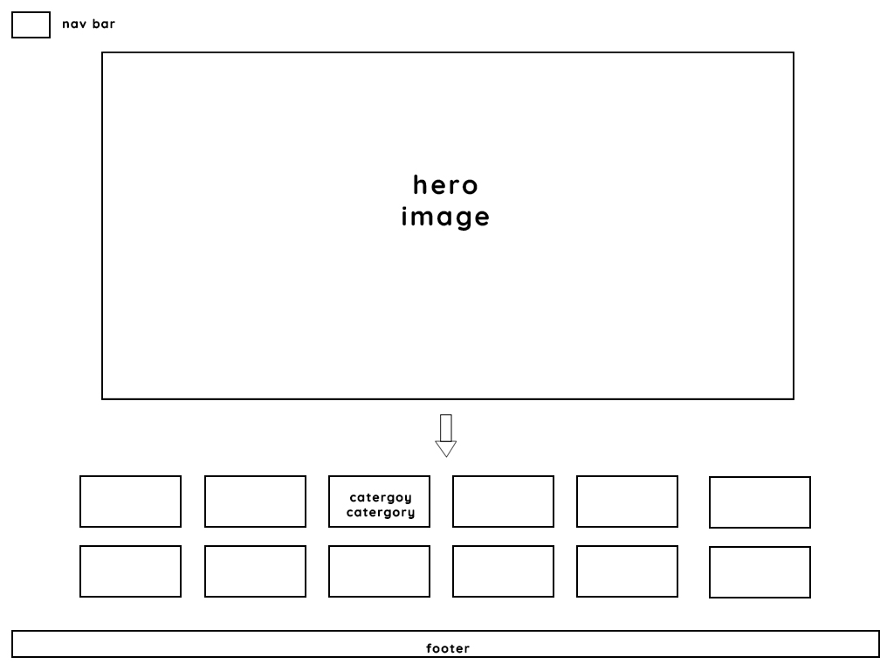 
# 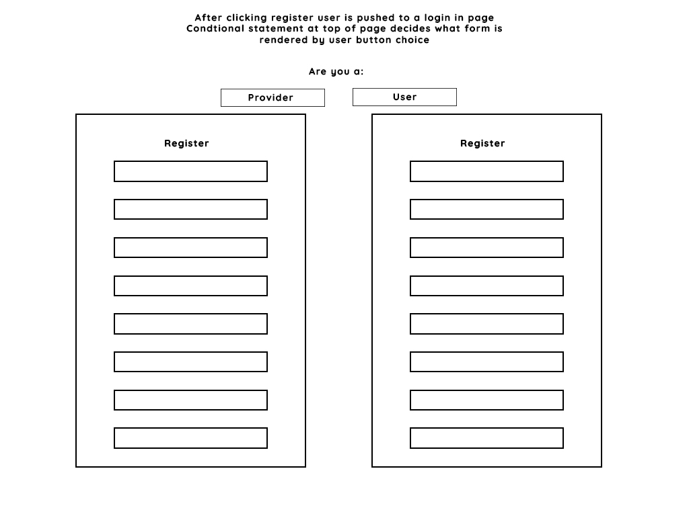 
# 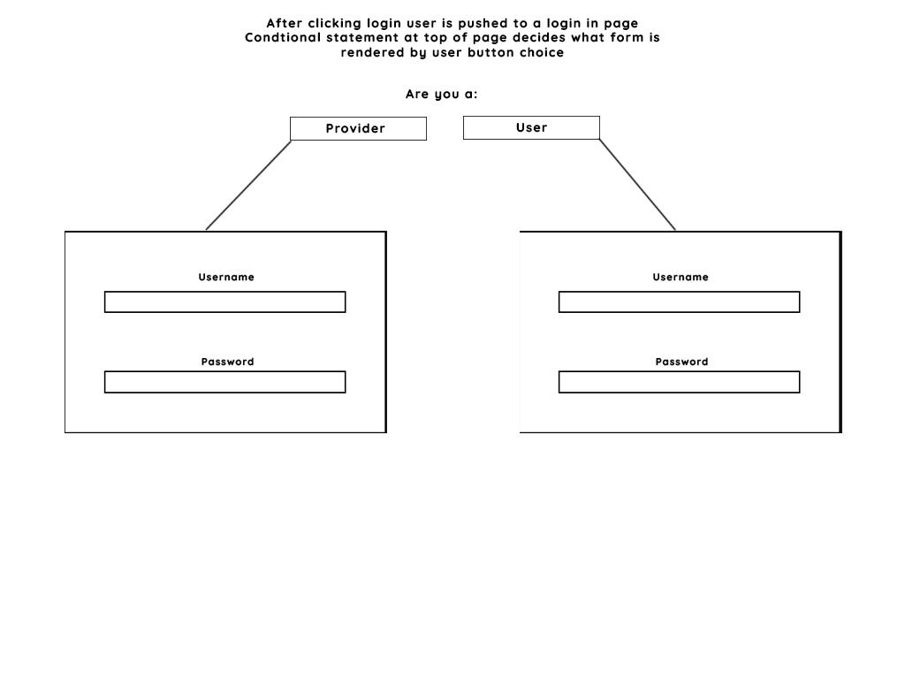 
# 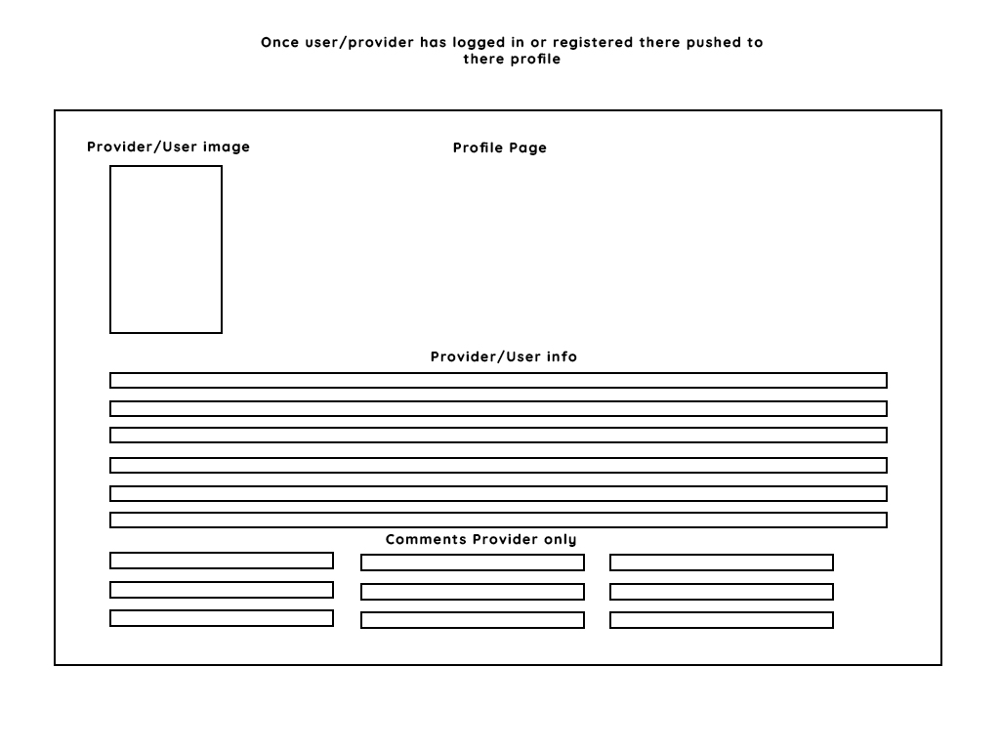 

In the planning phase we had worked out that we would need to create 40 ‘Auctioneer Profiles’ and 60 ‘Bidder’ profiles. Alberto had found a React dependency called ‘Faker.js’ that could create dummy users. Alberto took charge of creating the dummy users and incorporating ‘Faker.js’ into the data seeding process.

We decided on having 6 types of job categories Android Developer, Apple Developer, Back-end Developer, Front-end Developer, Game Developer and UI Developer. For each category we would create 10 jobs. 60 jobs in total. Sandra started working on creating the job seeds and I moved on to creating the shell for the back-end of the site.

The code snippet below is an example of a job seed.

# 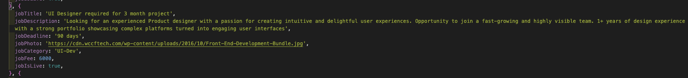

I started off by creating a new package.json file, touching a new ‘index.js’ file and installing the dependencies I would need to get the project started that included nodemon, express and mongoose. I then added a script to the ‘package.json’ to start nodemon for hot reloading. Then I moved on to creating the ‘startServer’ function in ‘index.js.  The ‘startServer’ function tested if the server was running on port 4000 and was connecting to the database. At this point I passed on creating the back-end to Sandra and began working on the remaining job seeds.

# 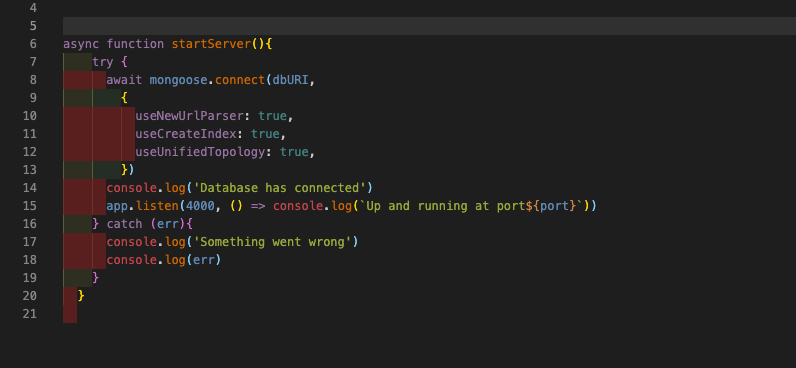

Sandra started creating the models for the user and the jobs. Then moved onto to the controllers and router. Testing each each controller as it was created using Insomnia to make API requests. Once it was established the API requests were working correctly Sandra implemented a secure route that would check if a user was logged into the website before giving them access to creating a job. With the secure route in place, a custom error handler was implemented to handle different types of errors the back-end might encounter while a user was a making a request.

The code snippet below is the user model.

# 

The image below are routes Sandra made in Insomnia to test routes.

# 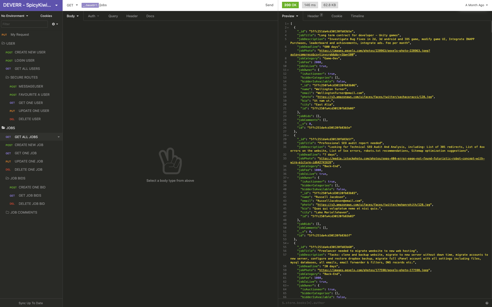

While Sandra was working on the back-end Alberto started to work on the, 'seedDatabase' function that would be used to add all the dummy data to the site and drop all the current data and refresh it with new data.

The code snippet below is 'seedDatabase' function.

# 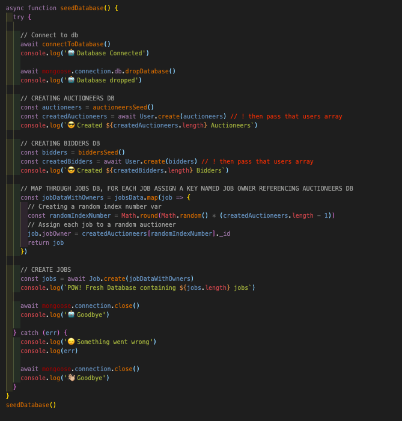

With Sandra working on the backend. I moved onto starting the front end and Alberto began styling the site.

I started off by creating a basic navigation, home, register and login component that only returned the name of each page. From there I imported those components into 'App.js' and imported 'react-router-dom' and began creating the routing for the website. Then moved onto the 'Nav' component and set-up the navigation bar. With the 'Nav' component working correctly I moved onto filling the 'Home' component with placeholder data that Alberto would change as he worked his way through styling the site. 

My next task was to create the register page to capture a users information and send a post request to the database. I created a new folder called lib and in the lib folder a file called 'api.js' that would store all the API requests made to the server and could be imported to other files as needed. We used 'Axios' to make all of our requests. Next I made another new file called, 'utils' and inside utils made a custom hook that would handle capturing users input and setting it into state. It also dealt with catching an error if a user had incorrecly filled in a form field.

The code snippet below is the custom hook used in login and register page.

# 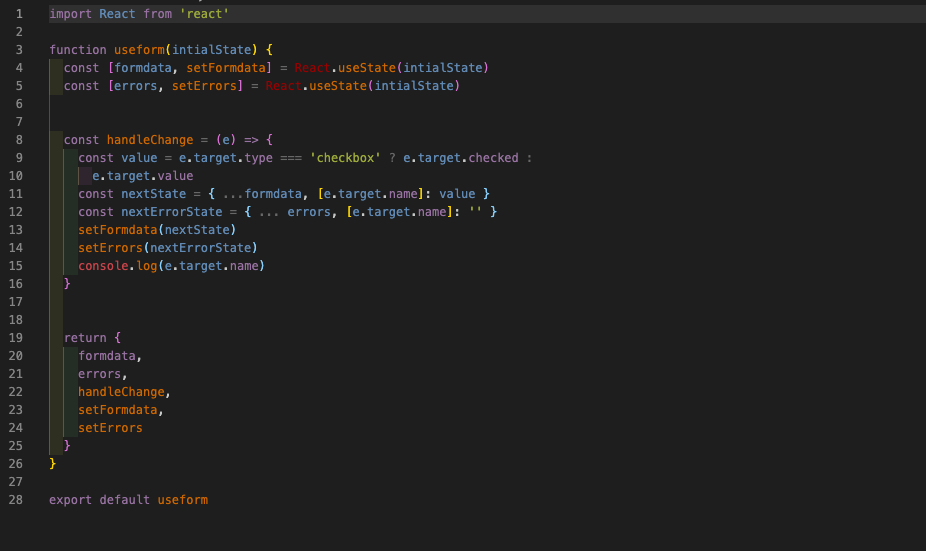

From here I moved to the, ‘Login’ component. To log a user in I  created a new file inside the ‘lib’ folder called ‘auth.js’, ‘auth.js’ held all the functions that were used to authenticate a user. Inside ‘auth.js’ I added a ‘setToken’ and ‘getToken function’, the ‘setToken’ function stored a users authentication token into local storage. I then added a logout function to the ‘Nav’ component. Creating a new function in ‘auth.js’ that removes a users token from local storage. Then a user is pushed back to the home page. From here I added functionality that would hide the login and register button and show the log out button if a user is logged in and vice versa if a user was logged out.

The code snippet below are the functions from the, 'auth.js' file to get, set and remove a users token.

# 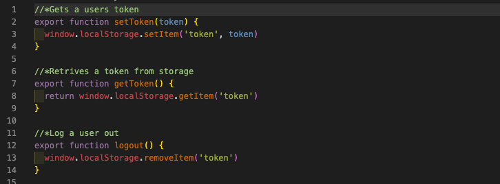

Moving on to creating the ‘UserShow’ component that would show the profile of the user who is currently logged in. This was only visible to that user. Creating a new GET request that used a users token to validate they were the current user. At this point Sandra had completed the back end and moved onto helping in the front-end working on the home page and creating the ‘UserIndex’ component that showed all the current users of the site. Alberto continued to work on the styling, he would a style page after I had added all the content to it.

Next was the, ‘JobIndex’ component that made a get request to the server to get all the jobs currently on the site. The data received back from the database was mapped over and each job was passed into its own component. Once all the data was displaying correctly I moved onto creating the ‘JobShow’ component that would show a detailed break down of a job when it was clicked by a user. This involved capturing the id of a job when it was clicked and passing the id in a post request to database and retrieving the information of that job.

The code snippet below is from the 'JobNew' component and shows the function that captures the job information from a user and the post request that is sent to database.

# 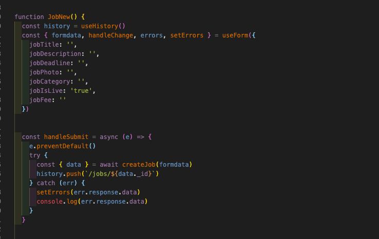

At this point the main pages of the site had been created. From here I went back through and added editing functionality to user profiles and jobs. They both used a get request to get the information of that user or job from the database that was in turn used to pre-populate a form for a user to edit. Taking the changes made by a user and making a PUT request to save the changes.

The code snippet below is from the 'JobEdit' component and shows the GET request to pre-populate a from, the function to capture the changes to a job and the PUT request to update the changes.

# 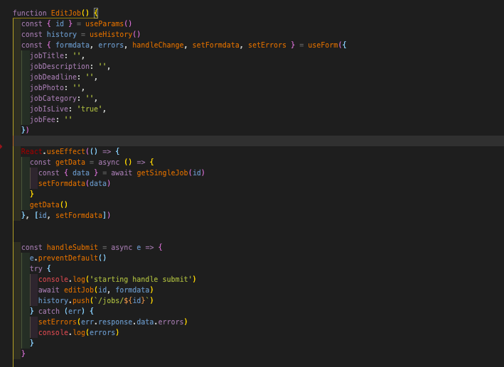

Lastly adding additional functionality to the ‘JobShow’ component this involved adding the functionality to allow a bidder to comment on a job using a put request. Then the bidding functionality that allowed a, 'Bidder' to place a bid via another put request on a job. After that is was the accepting a bid functionality that sent a PUT request to a job and changed the status of a job to false. It also sent a POST request to a, 'Bidder' that alerted the 'Bidder' that there bid had been accepted. 

<h2>Challenges</h2>

This was the first group project I did while at General Assembly. This brought about new challenges that I had not encountered before. The most prevalent being all working on one Github repository at the same time and avoiding merge conflicts, but we soon overcame this by using a Trello Board to track what each team member was working on and also having clear communication in the team throughout the whole project. 

The biggest challenge we ran into was the model for the user profile. Initially we had decided to have two different models, a model for the ‘Bidder’ and a model for the ‘Auctioneer’. We thought this approach would give more clarity and separation between the two types of users and the ‘Bidder’ model required additional information. Once we began building we found this wan’t the most practical approach as we would  need to repeat the same code twice for each user in multiple areas of this site. To solve the problem we decided to use one user model and make the additional fields required for the ‘Bidder’ profile not automatically required on the back-end. Then on the font end we would use conditional statements to hide and reveal what each user could see dependent on there profile type.

<h2>Wins</h2>

I think the biggest win as a team was firstly how well we worked together throughout the project. We were able to communicate clearly  resulting in each team member having a voice in the decision making process. Secondly we could help each other out when we ran into blockers and have group coding sessions to get past it.

Personally the biggest win for me was was working out how I could notify a ‘Bidder’ that they had the winning bid after it was chosen by the ‘Auctioneer’. As I was working on the ‘handleAcceptingBid’ function I realised that I had access to the id of the person who had created the bid. With the id I would be able to add an additional field to the user model called ‘Message’.

# 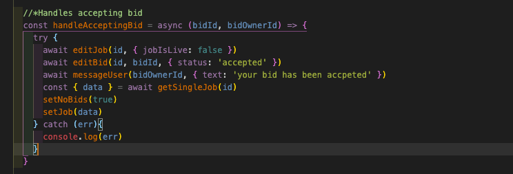 

# 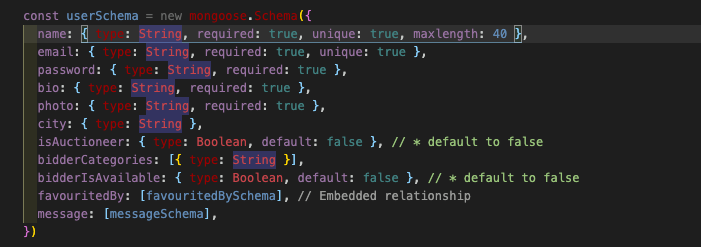 

Then add a new controller to ‘user.js’  controller file. That would push a new message onto the ‘message’ array of the ‘Bidder’ with the winning bid.

# 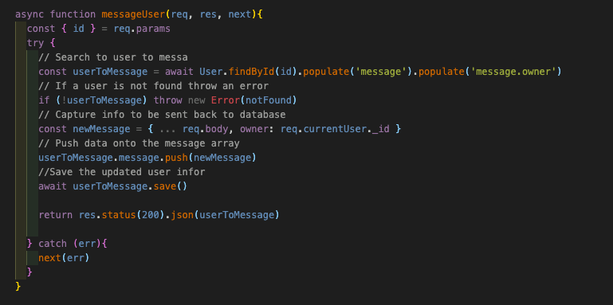 

From there I displayed the message on the profile of the winning ‘Bidder’. Where they would be guaranteed to see the message because a user would always land on there user profile first after logging in.

# 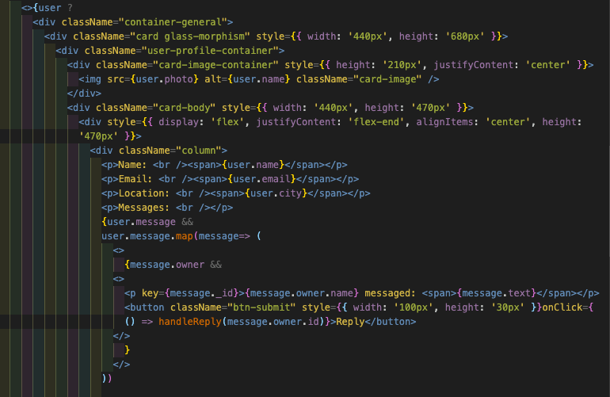 

<h2>Learnings</h2>
<ul>
<li>The importance of clearly thinking database models through. Not just the information they will contain but how that information will effect other areas of the site.</li>
<li>Clear communication when working as a team is essential.</li>
</ul>

<h2>Future Features</h2>

If I had more time I would like to:

<ul>
<li>Change the messaging function so that it is viewable from any page on the website and make it more seamless.</li>
<li>Make the site more mobile responsive.</li>
<li>Add notification animations.</li>
 </ul>

---
## License & copyright
This project was build for educational purposes. All the information on the website, including profiles and job adds, is fictitional. 

©️ [Alberto Cerrone](www.linkedin.com/in/alberto-cerrone)
©️ [Sandra Spighel](https://www.linkedin.com/in/sandraspighel)
©️ [Tim Frame](https://www.linkedin.com/in/tim-frame-187241100/)

